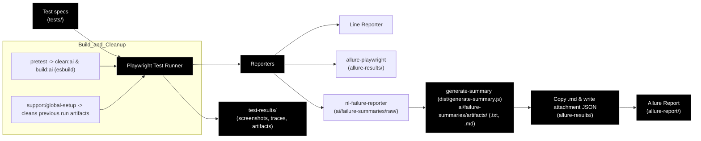

# Playwright Test Framework

This workspace contains a Playwright-based end-to-end testing setup for web applications. The framework supports multiple test suites with Page Object Model architecture, custom fixtures, and multi-browser execution.

## What's Included

- **Playwright Test runner** with TypeScript and JavaScript support
- **Configured browser projects**: Chromium and Firefox where supported by the suite
- **Page Object Model (POM)** architecture for maintainable tests
- **Custom fixtures** for authentication and test setup
- **HTML report generation** with screenshots, traces, and artifacts
- **Pre-configured base URLs** for demo applications

## Prerequisites

- Node.js 18 or newer
- npm

## Setup

Install the project dependencies:

```bash
npm install
```

Install the browser binaries required by Playwright:

```bash
npx playwright install
```

Optional but recommended: install the VS Code extension "Playwright Test for VS Code".

## Running Tests

Run all tests across all projects:

```bash
npm test
# or
npx playwright test
```

### Run Specific Test Suites

```bash
# TodoMVC tests
npm run test:todo-mvc

# UI Testing Playground tests
npm run test:ui-testing-playground

# OrangeHRM tests
npm run test:orange-hrm

# Demo Web Shop tests
npx playwright test ui/tests/demo-web-shop --project=demo-web-shop-chromium

# Practice Test Automation tests
npx playwright test ui/tests/practice-test-automation --project=practice-test-automation-chromium

# SauceDemo tests
npx playwright test ui/tests/saucedemo --project=saucedemo-chromium

# UI Testing Playground Firefox tests
npx playwright test ui/tests/ui-testing-playground --project=ui-testing-playground-firefox

# API tests (Playwright request-based API suite)
# Run only the API folder using the dedicated `api` project
npx playwright test api --project=api
```

### Run with Options

```bash
# Run in headed mode (visible browser)
npm run test:headed

# Run with Playwright UI mode
npm run test:ui

# Run specific browser project
npx playwright test --project=todo-mvc-chromium
npx playwright test --project=orange-hrm-chromium

# Open HTML report after a run
npm run test:report

# Generate and open an Allure report manually when needed
npx allure generate allure-results -o allure-report --clean
npx allure open allure-report
```

Every Playwright run automatically clears the previous `allure-results` data and
generates a fresh report in `allure-report/` during global teardown, including
single-test and filtered test runs.

## Project Structure

```text
.
├── playwright.config.ts          # Main Playwright configuration
├── package.json                  # Dependencies and npm scripts
├── ui/tests/                        # Test specifications
│   ├── fixtures/                 # Custom Playwright fixtures
│   │   └── orange-hrm.ts         # OrangeHRM login fixture
│   ├── orange-hrm/               # OrangeHRM test specs (JavaScript)
│   │   ├── add-delete-employee.spec.js
│   │   └── testAddDeleteEmployee.spec.js
│   ├── demo-web-shop/             # Demo Web Shop specs (TypeScript)
│   ├── practice-test-automation/  # Practice Test Automation specs (TypeScript)
│   ├── saucedemo/                 # SauceDemo specs (TypeScript)
│   ├── todo-mvc/                 # TodoMVC test specs (TypeScript)
│   │   ├── add-todos.spec.ts
│   │   ├── annotations.spec.ts
│   │   ├── seed.spec.ts
│   │   ├── testCodeGen.spec.ts
│   │   └── todo.spec.ts
│   └── ui-testing-playground/    # UI Testing Playground specs (TypeScript)
│       ├── ajax-data.spec.ts
│       ├── class-attribute.spec.ts
│       ├── click-event.spec.ts
│       ├── client-side-delay.spec.ts
│       ├── dynamic-id.spec.ts
│       ├── dynamic-table.spec.ts
│       ├── hidden-layers-click.spec.ts
│       ├── hidden-layers-not-clickable.spec.ts
│       ├── load-delay.spec.ts
│       ├── mouse-over-button.spec.ts
│       ├── mouse-over-link.spec.ts
│       ├── non-breaking-space.spec.ts
│       ├── overlapped-element.spec.ts
│       ├── pom-refactored.spec.ts
│       ├── progress-bar-start.spec.ts
│       ├── progress-bar-stop.spec.ts
│       ├── sample-app-enter.spec.ts
│       ├── sample-app-login.spec.ts
│       ├── scroll-bar.spec.ts
│       ├── shadow-dom.spec.ts
│       ├── text-input.spec.ts
│       ├── verify-text.spec.ts
│       ├── visibility-overlapped.spec.ts
│       ├── visibility-removed.spec.ts
│       └── visibility-zero-width.spec.ts
├── ui/pages/                        # Page Objects (POM)
│   ├── common/
│   │   └── BasePage.ts           # Shared typed page foundation
│   ├── demo-web-shop/             # Demo Web Shop page objects
│   ├── practice-test-automation/ # Practice Test Automation page objects
│   ├── saucedemo/                 # SauceDemo page objects
│   ├── orange-hrm/               # OrangeHRM Page Objects (JavaScript)
│   │   ├── BasePage.js           # Base page class
│   │   ├── LoginPage.js          # Login page actions
│   │   └── dashboard/
│   │       └── pim/
│   │           ├── AddEmployeePage.js    # Add employee actions
│   │           └── EmployeeInfoPage.js   # Employee list/search/delete
│   └── ui-testing-playground/  # UI Testing Playground Page Objects (TypeScript)
│       ├── BasePage.ts
│       ├── AjaxDataPage.ts
│       ├── ClassAttributePage.ts
│       ├── ClickEventPage.ts
│       ├── ClientSideDelayPage.ts
│       ├── DynamicIdPage.ts
│       ├── DynamicTablePage.ts
│       ├── HiddenLayersPage.ts
│       ├── LoadDelayPage.ts
│       ├── MouseOverPage.ts
│       ├── NonBreakingSpacePage.ts
│       ├── OverlappedElementPage.ts
│       ├── ProgressBarPage.ts
│       ├── SampleAppPage.ts
│       ├── ScrollBarPage.ts
│       ├── ShadowDomPage.ts
│       ├── TextInputPage.ts
│       ├── VerifyTextPage.ts
│       └── VisibilityPage.ts
├── ui/support/
│   ├── fixtures/
│   │   ├── base.ts               # Shared test and expect exports
│   │   └── index.ts              # Fixture barrel export
│   ├── global-setup/
│   └── global-teardown/
├── ui/test-data/                    # Feature-specific JSON test data
│   ├── demo-web-shop/
│   ├── practice-test-automation/
│   ├── saucedemo/
│   └── ui-testing-playground/
├── test-plans/                   # Test plans and exploratory documentation
├── .playwright-cli/              # Browser snapshots and console logs
├── allure-results/               # Raw Allure test results
├── allure-report/                # Generated Allure report
├── playwright-report/            # Generated Playwright HTML report
├── test-results/                 # Generated screenshots, traces, artifacts
└── README.md
```

## Framework Conventions

- Import `test` and `expect` from `support/fixtures/base.ts` in TypeScript specs.
- Keep application-specific locators and actions in `pages/<application>/`.
- Extend `pages/common/BasePage.ts` for shared navigation and page helpers.
- Keep assertions in test specs; page objects expose locators and actions.
- Store reusable scenario values in `test-data/<application>/` JSON files.
- Import JSON data with TypeScript `resolveJsonModule` support; keep secrets out of committed fixtures.
- Keep each Playwright project’s `baseURL` and test scope in `playwright.config.ts`.
- Prefer accessible locators and web-first assertions; avoid fixed timeouts.
- Keep generated snapshots, traces, and reports in their configured output folders.

## Test Suites Overview

| Suite | Application | Language | Test Files | Browser Projects |
| ------- | ------------- | ---------- | ------------ | ------------------ |
| **todo-mvc** | <https://demo.playwright.dev/todomvc> | TypeScript | 5 | Chromium, Firefox |
| **ui-testing-playground** | <http://uitestingplayground.com> | TypeScript | 25 | Chromium, Firefox |
| **demo-web-shop** | <https://demowebshop.tricentis.com> | TypeScript | 4 | Chromium |
| **practice-test-automation** | <https://practicetestautomation.com/practice-test-login/> | TypeScript | 3 | Chromium |
| **saucedemo** | <https://www.saucedemo.com> | TypeScript | 24 | Chromium |
| **orange-hrm** | <https://opensource-demo.orangehrmlive.com> | JavaScript | 2 | Chromium |

### OrangeHRM Test Suite

- Uses **Page Object Model** with JavaScript
- Custom **login fixture** (`tests/fixtures/orange-hrm.ts`) handles authentication
- Tests cover: Add Employee, Search Employee, Delete Employee
- Base URL: `https://opensource-demo.orangehrmlive.com/web/index.php/auth/login`

### UI Testing Playground

- 25 test scenarios covering various UI challenges:
  - Dynamic IDs, AJAX data, Client-side delays
  - Hidden layers, Overlapped elements, Shadow DOM
  - Progress bars, Scroll bars, Mouse interactions
  - Visibility, Text verification, Non-breaking spaces

### TodoMVC

- Basic CRUD operations for todo items
- Filtering (All/Active/Completed)
- Annotations and seed data tests

## Configuration Highlights

- **Test timeout**: 30 seconds
- **Assertion timeout**: 5 seconds
- **Parallel execution**: Enabled (`fullyParallel: true`)
- **Retries**: 2 on CI, 0 locally
- **Trace collection**: On first retry
- **Screenshot diff tolerance**: 10 pixels / 10% pixel ratio

## Notes

- Test files follow the `*.spec.ts` (TypeScript) or `*.spec.js` (JavaScript) pattern
- Suite-specific projects define application base URLs and browser coverage
- The configured reporters write line output and Allure results; Playwright HTML output is available through the standard report commands
- Page Objects are organized by application under `pages/`
## Workflow

The diagram below shows the core test-execution and reporting flow used by this repository (Playwright runner, reporters, AI failure-summaries generator, and Allure integration).



## Reference

- <https://playwright.dev/docs/intro>
- <https://playwright.dev/docs/test-configuration>
- <https://playwright.dev/docs/page-object-models>
## Recent changes

- **UI:** Consolidated fixtures under `ui/support/fixtures/`, created `ui/ui_test_architecture.md`, and updated tests to import fixtures from the new location.
- **API:** Added `api/api_test_architecture.md` as the canonical agent reference for API tests and consolidated model schemas under `api/models/schemas/`.
- **Models:** Removed the duplicate root `models/` folder; canonical models now live under `api/models/`. Created `ui/models/README.md` as a placeholder for future UI models.
- **Tooling:** Workspace setting `todo-tree.ripgrep` was set to `C:\ProgramData\chocolatey\bin\rg.exe` to resolve the Todo-Tree ripgrep error.
## Maintainers / Contact

- Ritesh Mishra

